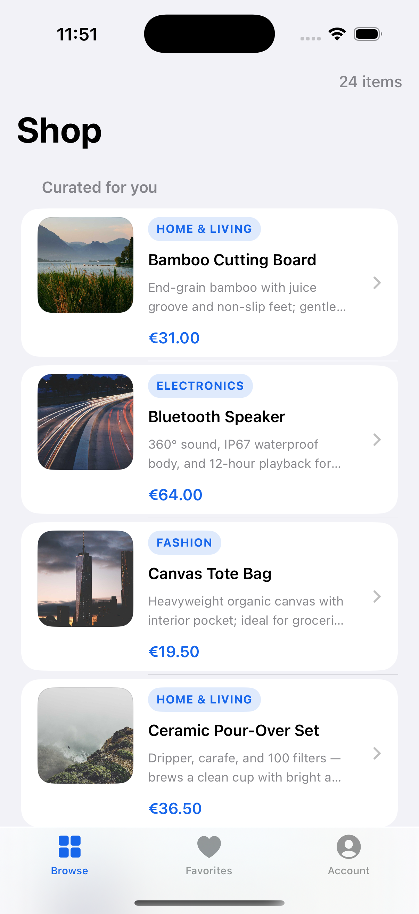
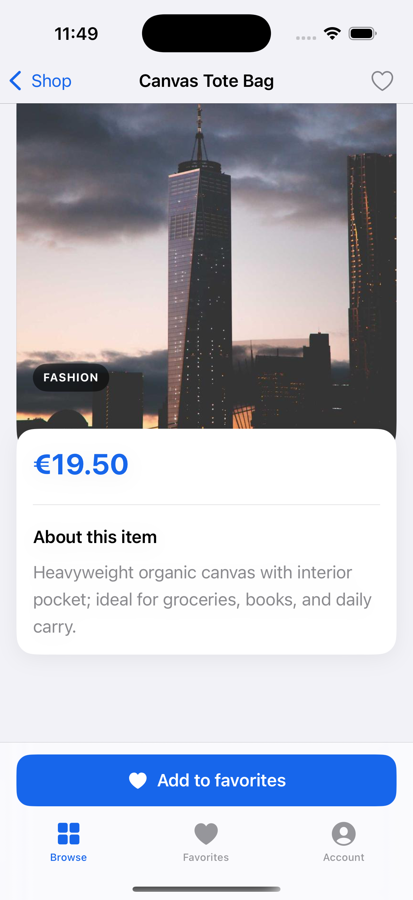
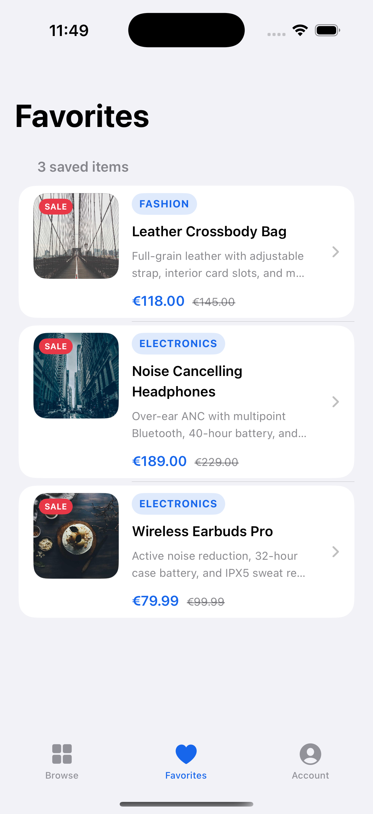
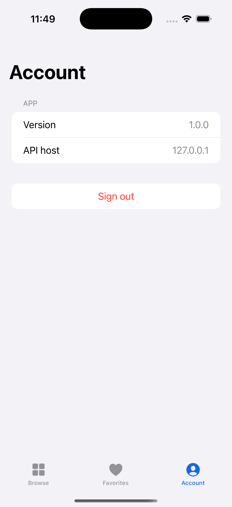
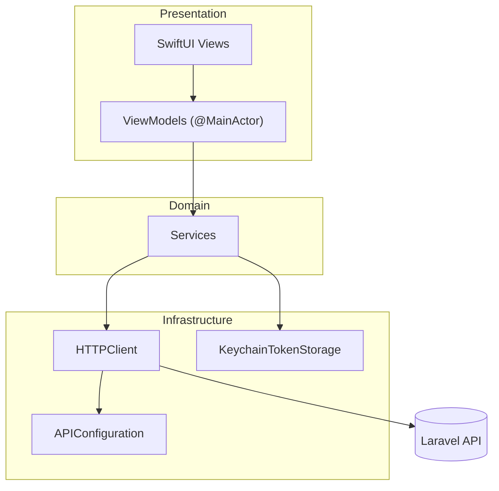

# iOS Marketplace Product App

[](https://github.com/sameh-bakleh/ios-marketplace-product-app/actions/workflows/ios-ci.yml)
[](https://developer.apple.com/ios/)
[](https://swift.org)
[](LICENSE)

**Senior-grade SwiftUI marketplace client** — MVVM, Combine, JWT auth, paginated REST, Keychain, favorites sync, design system, and XCTest. Pairs with [`laravel-marketplace-platform`](https://github.com/sameh-bakleh/laravel-marketplace-platform) for a full-stack portfolio demo.

> **30-second summary:** Production-style iOS app (login → browse → detail → favorites) with protocol-oriented services, typed errors, loading/empty/error UX, and CI — built the way EU product teams structure client code, not a single-screen tutorial.

---

## Evaluate in 10 minutes

```bash
git clone https://github.com/sameh-bakleh/ios-marketplace-product-app.git
cd ios-marketplace-product-app
xcodegen generate
xcodebuild test \
  -project IOSMarketplaceProductApp.xcodeproj \
  -scheme IOSMarketplaceProductApp \
  -destination 'platform=iOS Simulator,name=iPhone 16,OS=latest' \
  CODE_SIGNING_ALLOWED=NO
```

| Step | Action |
|------|--------|
| 1 | Skim `App/AppEnvironment.swift` — composition root |
| 2 | Read `Core/Network/HTTPClient.swift` — auth, decode, errors |
| 3 | Open `Features/Products/ProductListViewModel.swift` — pagination |
| 4 | Run on Simulator · tap **Continue with demo account** (needs API on `:8000`) |

**Full stack:** start [`laravel-marketplace-platform`](https://github.com/sameh-bakleh/laravel-marketplace-platform) → `demo@example.com` / `password`.

---

## At a glance

| Question | Answer |
|----------|--------|
| **What is it?** | Marketplace iOS client: auth, catalog, product detail, favorites, account. |
| **Why does it matter?** | End-to-end mobile ownership — architecture, networking, state, UX states, tests, CI. |
| **Backend** | [`laravel-marketplace-platform`](https://github.com/sameh-bakleh/laravel-marketplace-platform) · `http://127.0.0.1:8000` |
| **Stack** | Swift 5.9 · SwiftUI · MVVM · Combine · Alamofire · Keychain · XcodeGen |
| **Quality** | 34 XCTest cases · GitHub Actions on every push |

---

## Screenshots

| Login | Shop catalog | Product detail |
|:-----:|:------------:|:--------------:|
| [](Docs/Screenshots/01-login.png) | [](Docs/Screenshots/02-shop-catalog.png) | [](Docs/Screenshots/03-product-detail.png) |

| Favorites | Account |
|:---------:|:-------:|
| [](Docs/Screenshots/04-favorites.png) | [](Docs/Screenshots/05-account.png) |

iPhone 16 Pro · iOS 18.4 · paired with [`laravel-marketplace-platform`](https://github.com/sameh-bakleh/laravel-marketplace-platform) (`demo@example.com` / `password`).

---

## Features

| Flow | Implementation |
|------|----------------|
| **Sign in** | Email/password → JWT in Keychain → gated `RootView` · one-tap demo account |
| **Browse** | Paginated `GET /api/products` · infinite scroll · pull-to-refresh · card rows |
| **Product detail** | Hero image · sale pricing · description · toolbar + bottom favorites CTA |
| **Favorites** | Dedicated tab · local ID cache · server sync on login and tab open |
| **Account** | Signed-in profile · API host · sign out clears Keychain + favorites cache |
| **Design system** | `MarketplaceTheme` spacing/radii · `CategoryBadge` · `ProductPriceView` |
| **Resilience** | `LoadState` · `ErrorBanner` · retry · Laravel paginator decoding |

---

## Architecture



| Folder | Role |
|--------|------|
| `App/` | `@main`, `AppEnvironment`, auth gate, tab shell |
| `Features/` | Auth · Products · ProductDetail · Favorites |
| `Core/` | Models, `HTTPClient`, services, pagination, Keychain |
| `Shared/` | Design system, reusable components, formatters |

Deeper notes: [Docs/ARCHITECTURE.md](Docs/ARCHITECTURE.md)

---

## Tech stack

| Layer | Choice |
|-------|--------|
| UI | SwiftUI (UIKit only for system color bridges) |
| Architecture | MVVM + protocol-oriented services + `AppEnvironment` |
| Async | Combine · `@MainActor` view models |
| Networking | Alamofire 5 · REST/JSON · explicit `CodingKeys` (no snake_case strategy clash) |
| Security | Keychain tokens · ATS local networking for dev |
| Project | XcodeGen (`project.yml`) |
| Tests | XCTest · protocol mocks |
| CI | GitHub Actions · `macos-15` |

---

## How to run

**Requirements:** macOS · Xcode 15+ · [XcodeGen](https://github.com/yonaskolb/XcodeGen)

```bash
git clone https://github.com/sameh-bakleh/ios-marketplace-product-app.git
cd ios-marketplace-product-app
xcodegen generate
open IOSMarketplaceProductApp.xcodeproj
```

1. Start the API (see [laravel-marketplace-platform](https://github.com/sameh-bakleh/laravel-marketplace-platform)) on port **8000**
2. Select an **iOS Simulator** → **⌘R**
3. Tap **Continue with demo account** or sign in with `demo@example.com` / `password`

| API base URL override | How |
|-----------------------|-----|
| Default | `http://127.0.0.1:8000` |
| UserDefaults | key `marketplace.api.baseURL` |
| Xcode scheme | env `MARKETPLACE_API_BASE_URL` |

Device builds: set your **Team** under Signing & Capabilities.

---

## How to test

```bash
xcodegen generate
xcodebuild test \
  -project IOSMarketplaceProductApp.xcodeproj \
  -scheme IOSMarketplaceProductApp \
  -destination 'platform=iOS Simulator,name=iPhone 16,OS=latest' \
  CODE_SIGNING_ALLOWED=NO
```

| Layer | Coverage |
|-------|----------|
| Models | `Product`, `AuthResponse`, `PaginatedResult`, Laravel fixture decode |
| ViewModels | Auth, list pagination, detail, favorites |
| Services | Favorites sync · Keychain |
| App | Sign-out clears session |

Mocks: `IOSMarketplaceProductAppTests/Helpers/`

---

## API contract

`Accept: application/json` · `Authorization: Bearer <token>` on protected routes

| Method | Path | Notes |
|--------|------|-------|
| POST | `/api/login` | `{ email, password }` → `{ token, user }` |
| GET | `/api/products` | `page`, `per_page` → `{ data, meta }` |
| GET | `/api/products/{id}` | Single product |
| GET | `/api/favorites` | `{ data: [Product] }` |
| POST | `/api/favorites` | `{ product_id }` |
| DELETE | `/api/favorites/{id}` | Remove favorite |

`Product` decodes string/numeric prices, `compare_at_price`, and absolute or relative `image_url`.

---

## CI/CD

[`.github/workflows/ios-ci.yml`](.github/workflows/ios-ci.yml) — `xcodegen` → build → 34 unit tests on `macos-15` for every push/PR to `main`.

---

## Security

- Tokens in **Keychain** — not UserDefaults  
- No secrets in git · [SECURITY.md](SECURITY.md)  
- Local HTTP via `NSAllowsLocalNetworking` (dev only)

---

## Recruiter note

| | |
|---|---|
| **Type** | Portfolio · production-style patterns |
| **App Store** | Not shipped — technical sample |
| **Full stack** | iOS app + [`laravel-marketplace-platform`](https://github.com/sameh-bakleh/laravel-marketplace-platform) |
| **Review path** | README → tests → `HTTPClient.swift` → `ProductListViewModel.swift` |
| **Contact** | [GitHub](https://github.com/sameh-bakleh) · [Portfolio](https://sameh-bakleh.vercel.app/) |

---

## License

[MIT](LICENSE) · [Contributing](CONTRIBUTING.md) · [Security](SECURITY.md)
